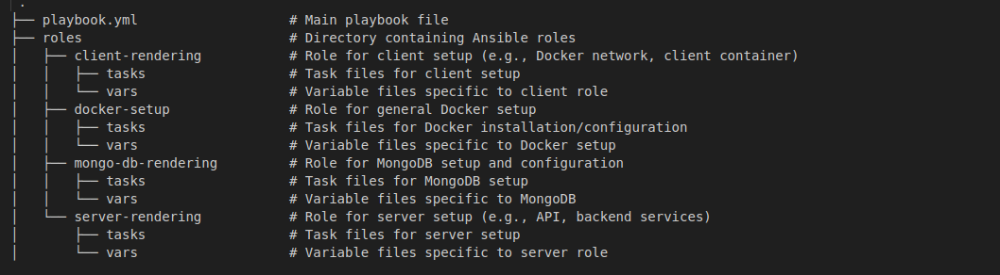
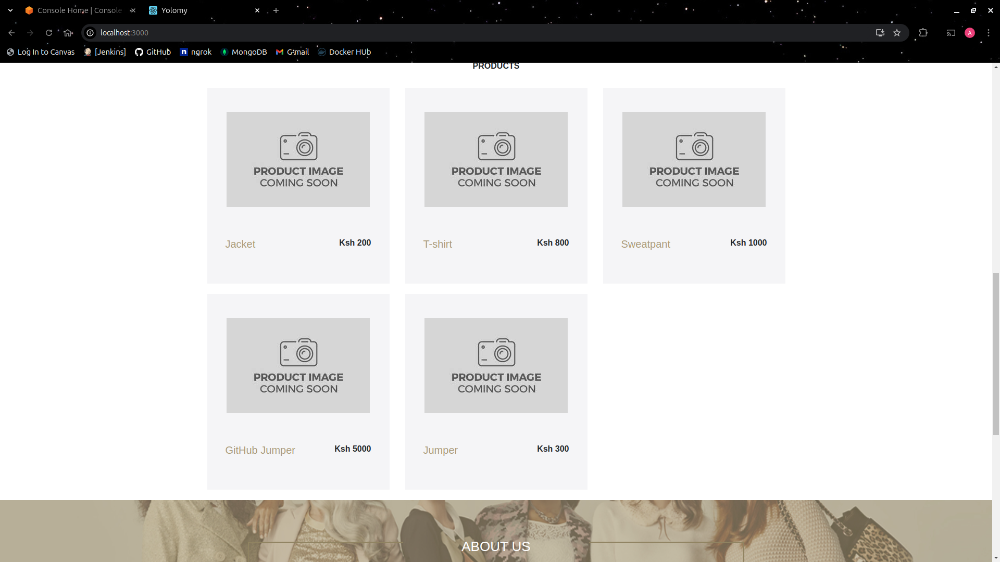

# Automated Ansible Configuration Playbook

## Overview

This project sets up an automated Ansible configuration playbook that provisions a Vagrant virtual machine with the latest Ubuntu server (20.04) and deploys an e-commerce web application. The application includes a dashboard for managing retail products and provides functionality to add products via a user-friendly form.

## Prerequisites

- [Vagrant](https://www.vagrantup.com/downloads) installed on your machine.
- [VirtualBox](https://www.virtualbox.org/) installed as the Vagrant provider.
- Basic knowledge of Ansible and Vagrant.

## Installation

1. Clone this repository:

   ```bash
      git clone git@github.com:Allan-Binga/yolo.git

   ```
   Enter into the root directory if the project using:
   ```bash
       cd yolo

 ## Initialize vagrant       

2. Initialize the Vagrant environment:
```bash
       vagrant up

```

3. Once the VM is running, run the ansible playbook as follows:
```bash
       ansible-playbook -i inventory.yml playbook.yml

```

4. Ensure that Ansible is installed within the VM by provisioning with the playbook. The playbook is organized as follows:
      

5. Usage:
After provisioning, the playbook will automatically run the necessary tasks to set up the application. Once complete, access the application in your web browser at:
```bash
  http://localhost:3000
```

6. I was able to provision up the playbook and added products listed below;
               
