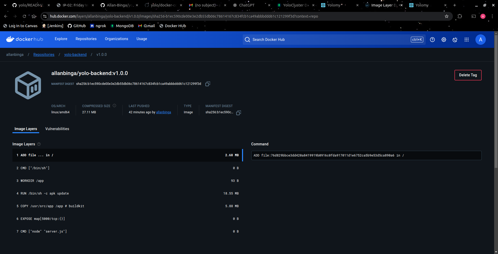
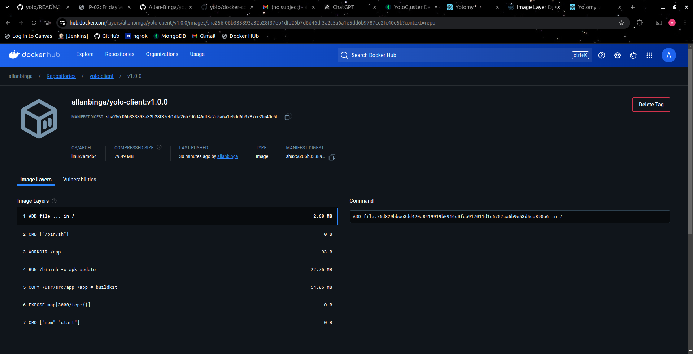

# YOLO Microservices E-Commerce Application

## Project Overview
This project is a microservices-based e-commerce application that utilizes Docker and Docker Compose to run a backend service, a client service, and a MongoDB database. The backend service handles product management, while the client service provides a user interface.

## Features
- Microservices architecture with separate backend and client services
- Persistent data storage using MongoDB
- Dockerized services for easy deployment and scalability

## Technologies Used
- Docker
- Docker Compose
- Node.js (for backend)
- MongoDB (for database)
- React for the client side

## Setup Instructions
1. Clone the repository

    git clone <https://github.com/Allan-Binga/yolo>
    cd 'yolo'

2. Build the docker images
docker-compose build

3. Start the services
docker-compose up

4. Access the yolo application in your web browser at <http://localhost:3000/>

## To Pull the Docker images from dockerhub:
docker pull allanbinga/yolo-backend:v1.0.0
docker pull allanbinga/yolo-client:v1.0.0

## Sizes of the images are as follows(screenshots):
 - For the backend image
 - For the client image

# To run the application using Docker:
docker-compose up

